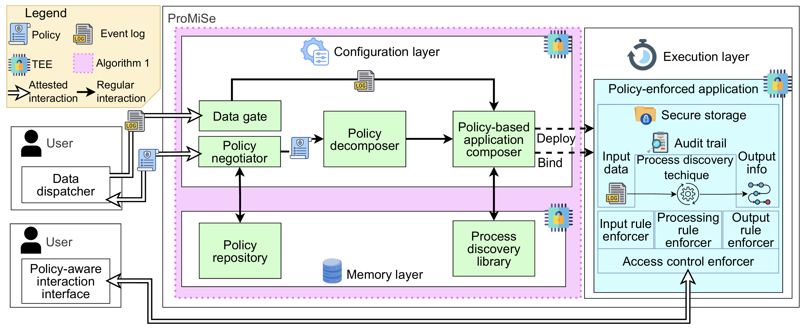

# ProMiSe  

**ProMiSe** (*P*olicy-aware p*ro*cess *M*ining *Se*rvice) is a software framework and service that enables controlled information usage in process mining.  
ProMiSe focuses on **process discovery** and enforces **usage control** rules expressed as policies.  
These policies are executed within a **Trusted Execution Environment (TEE)** to guarantee confidentiality and privacy of sensitive event log data.  



## Publication
Our solution was presented at [ICSOC 2025](https://icsoc2025.hit.edu.cn/19959/list.htm). The slide deck is available on [SlideShare](https://www.slideshare.net/slideshow/usage-control-for-process-discovery-through-a-trusted-execution-environment/284554072).

For further information, consult our paper:
- Valerio Goretti, Sabrina Kirrane, Claudio Di Ciccio (2025). *Usage Control for Process Discovery through a Trusted Execution Environment*. [Service-Oriented Computing
23rd International Conference, ICSOC 2025, Shenzhen, China, December 1–4, 2025, Proceedings](https://link.springer.com/book/9789819550111). Springer (to appear)

---
## Project Structure

```text
├───DataOwner | user application 
├───Platform | process discovery service provider application
│   ├───PolicyDecoder | policy decoder module 
│   ├───SecureAppComposer | secure app composer module 
│   └───TAgenerator | configuration layer generator
└───Test | Test folder
    ├───memConsumption | memory consumption test
    ├───overhead | overhead tests
    └───scalability | scalability test
```

## Setup  

### Dependencies  
To set up and run the project, you need to have the following dependencies installed:  

- [Go](https://golang.org/dl/) (version **1.16** or later)  
- [Python](https://www.python.org/downloads/) (version **3.6** or later)  
- [ego](https://github.com/edgelesssys/ego) (Edgeless Systems' confidential computing framework)  
- Intel SGX enabled CPU (required to run the process vault in **non-simulation** mode)  

---

## Running the Project  
1. Clone this repository:  
   ```bash
   git clone https://github.com/ValerioGoretti/ProMise.git
   cd promise
    ```

### User side
2. Enter in the folder:  
    ```bash
    cd Platform/Ower
    ```
3. Build and sign the project:  
    ```bash
    pyton3 main
    ```

### Process discovery service side
2. Enter in the folder:  
    ```bash
    cd Platform/TAgenerator
    ```

3. Build and sign the project:  
    ```bash
    ego-go build main.go
    ego sign main
    ```

4. Run the project (with TEE-enabled processor):  
    ```bash
    ego run main
    ```

5. Run the project (simulation mode):  
    ```bash
    ego run OE_SIMULATION=1 main
    ```
    
